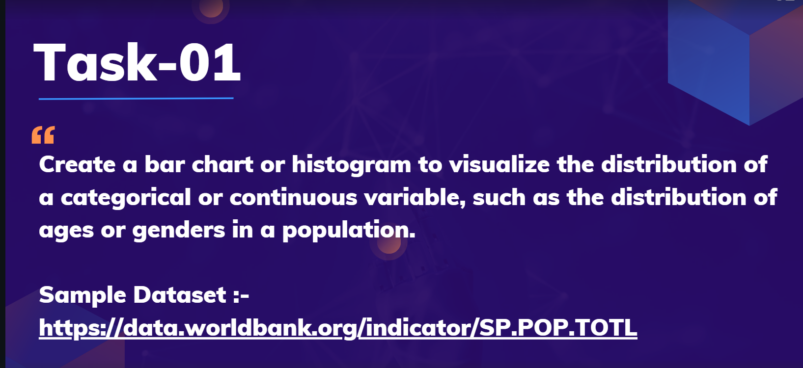

# Prodigy InfoTech Data Science Internship
## Task1: Population Distribution Visualization

## Introduction

In this project, I performed Exploratory Data Analysis (EDA) on the World Bank Total Population dataset as part of the Data Science Internship at **Prodigy Infotech**. The main objective was to clean and analyze the data and create visualizations such as a histogram and a bar chart to show the distribution of population across countries for the year 2023.
## Dataset

The dataset used for this task is the [World Bank Total Population dataset](https://data.worldbank.org/indicator/SP.POP.TOTL).

This dataset contains records of the total population of countries from 1990 to 2023. For this analysis, I used the most recent data available (2023).

## Task Description

The objective of this task was to create a bar chart or histogram to visualize the distribution of a categorical or continuous variable. For this project, I analyzed the 2023 population data of different countries to illustrate how population is distributed globally and to highlight the most populous countries.
## Tools and Libraries Used

- **Jupyter Notebook**
- **Pandas** – Data manipulation and cleaning
- **Matplotlib** – Data visualization
- **Seaborn** – Enhanced plotting
## Analysis Highlights

- Selected and cleaned the 2023 population data for all countries from the World Bank dataset.
- Handled missing values and ensured the population data was in a numeric format.
- Created a histogram to visualize the overall distribution of population across countries.
- Observed a right-skewed distribution, where a small number of countries have extremely high populations.
- Generated a bar chart showing the Top 10 most populous countries in 2023.
- Identified countries like India and China as dominant contributors to global population figures.
## Conclusion
In conclusion, this EDA provided valuable insights into the global distribution of population. The histogram revealed that most countries have moderate population sizes, while a few countries have extremely large populations. The bar chart clearly identified the top contributors to the world population.

This analysis forms the foundation for further demographic studies and modeling.
