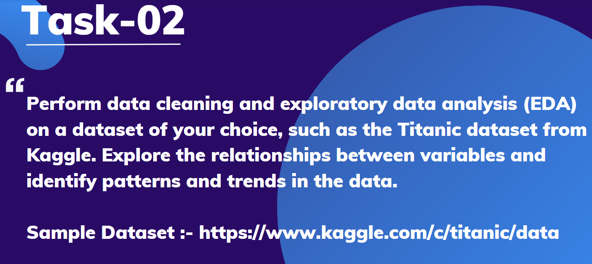

# Data Science Internship
## Task 2: Exploratory Data Analysis on Student Performance Dataset

## Introduction
This project is part of my Data Science Internship at **Prodigy Infotech**.  
The objective was to perform **data cleaning** and **exploratory data analysis (EDA)** on a dataset of student performance, to explore relationships between variables and identify patterns and trends.
## Dataset
The dataset used for this analysis is **StudentsPerformance.csv**, which contains 1,000 records with the following attributes:

- Gender
- Race/Ethnicity
- Parental Level of Education
- Lunch Type
- Test Preparation Course Completion
- Math Score
- Reading Score
- Writing Score
## Tools and Libraries Used
- **Python**
- **Pandas** – data manipulation
- **Matplotlib** – plotting
- **Seaborn** – statistical visualization
## Exploratory Data Analysis (EDA)
Several visualizations were created to understand the relationships between variables:

1. Math Scores by Gender

Box plot comparing math scores between male and female students.

2. Writing Scores by Parental Education Level

Box plot illustrating the impact of parents' education on writing scores.

3. Reading Scores by Lunch Type

Box plot comparing reading scores for students with standard vs. free/reduced lunch.

4. Correlation Heatmap

Heatmap showing correlations among math, reading, and writing scores.

5. Average Scores

Calculated the average score for each student across all subjects.
## Key Findings
Gender Differences:
Female students scored higher in reading and writing, while math scores were more balanced.

Test Preparation:
Students who completed a test preparation course achieved significantly higher average scores (72.67) compared to those who did not (65.03).

Lunch Type:
Students with standard lunch outperformed those with free/reduced lunch.

Parental Education:
Higher parental education levels correlated with better performance, especially in reading and writing.

Correlation:
Strong positive correlation between scores across all subjects.
## Conclusion
This EDA revealed clear trends linking socio-economic factors and preparation efforts to student academic performance. The analysis highlights the importance of parental education, nutrition, and targeted preparation in improving learning outcomes.
