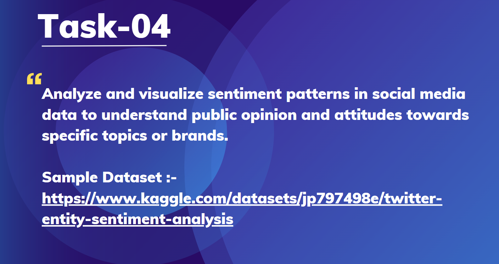

# Datascience Intern
## Task 4: Sentiment Analysis on Social Media Data

## Introduction
This project focuses on analyzing and visualizing sentiment patterns from Twitter data to understand public opinion on specific topics or brands. 

Using NLP techniques such as text preprocessing and TF-IDF vectorization, a Logistic Regression model was trained to classify tweets into **Positive**, **Negative**, **Neutral**, and **Irrelevant** sentiments. Data visualization tools like Seaborn and WordCloud were used to explore sentiment distributions and highlight frequent terms.
## Tools Used
1. Python
2. Pandas
3. scikit-learn
4. NLTK
5. Matplotlib
6. Seaborn
7. WordCloud
## Dataset Description
The dataset used in this project consists of annotated Twitter posts, provided in two CSV files: `twitter_training.csv` and `twitter_validation.csv`. Each tweet is labeled with a sentiment category to enable supervised learning for sentiment classification.
## Task Description

The objective of this task is to analyze and visualize sentiment patterns in social media (Twitter) data to understand public opinion and attitudes toward specific topics or brands.

### Goals:
- Clean and preprocess raw tweet data  
- Perform Exploratory Data Analysis (EDA) to explore sentiment distribution  
- Generate visualizations such as word clouds for different sentiments  
- Train a machine learning model to classify tweets into `Positive`, `Negative`, `Neutral`, or `Irrelevant` categories  
- Evaluate model performance using metrics like accuracy, F1-score, and a confusion matrix
## Analysis Highlights

- ✅ Cleaned and preprocessed over 1,000 tweets using NLP techniques such as stopword removal, tokenization, and regex filtering.
- 📊 Performed Exploratory Data Analysis (EDA) to visualize sentiment distribution across `Positive`, `Negative`, `Neutral`, and `Irrelevant` classes.
- ☁️ Generated word clouds to highlight the most frequent terms associated with each sentiment.
- 🤖 Trained a Logistic Regression model using TF-IDF vectorized features for sentiment classification.
- 📈 Achieved an overall **accuracy of ~80%** on the validation set.
- 🧠 Analyzed classification metrics and confusion matrix to assess model performance and identify improvement areas.
- 💬 Gained insights into public sentiment trends, which can support brand monitoring and audience feedback analysis.
## Conclusion

- This project successfully demonstrates the application of Natural Language Processing (NLP) and machine learning techniques for sentiment analysis on social media data. By preprocessing tweets, vectorizing text using TF-IDF, and training a Logistic Regression model, we were able to classify sentiments with a high degree of accuracy.
- The insights gained from sentiment distribution and word clouds help in understanding public opinion, which is valuable for brand reputation management, customer feedback analysis, and market research.

